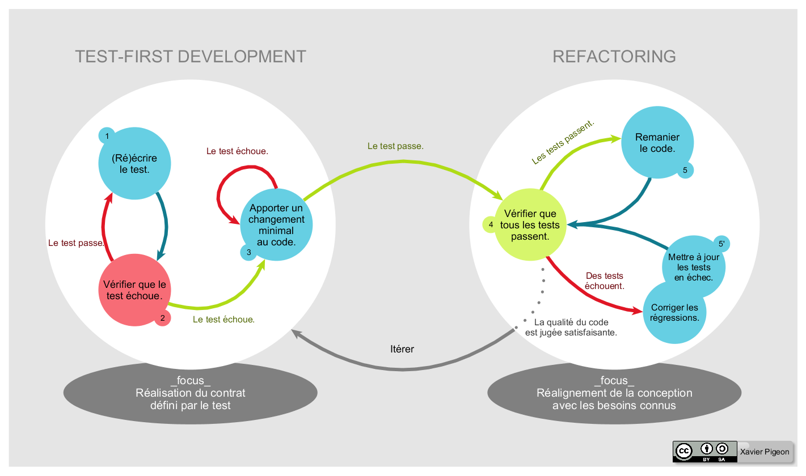

= Coding Dojo
Kevin MARCELLIER

:backend: deckjs
:deckjs_transition: horizontal-slide
:split:

== Deux formats

[%step]
--
**KATA**

- Un problème
- Une solution présentée par un ou des binôme(s)
- On décortique et on refait
--

[%step]
--
**RANDORI**

- Un problème
- Résolution progressive
- Une personne au clavier, tourne toutes les 5 minutes
--

== Test Driven Developmnent (TDD)

Le cycle de développement :
[%step]
- Ecriture d'un test unitaire
- Vérification que le test échoue
- Ecriture du test suffisant pour passer le code
- Vérification que le test passe
- Refactoring du code

[%step]

== TDD : Avantages

[%step]
--
- Les tests unitaires sont réellement écrits.

Le fait de commencer par rédiger les tests permet de s'assurer que les tests seront écrits.
--
[%step]
--
- La satisfaction du développeur permet d'obtenir un code plus cohérent.

Il s'agit d'une sorte de défi de faire valider les tests, C'est une sensation d'accomplissement.
--
[%step]
--
- Clarification des détails de l'interface et du comportement

Le développeur va devoir penser aux détails de la méthode dont il a besoin pour écrire la spécification. Cela permet de clarifier la conception et d'écrire seulement du code utile.
--
[%step]
--
- Vérification démontrable, répétable et automatisé

Le fait de disposer d'un grand nombre de test permet de s'assurer de la solidité et garantie du code.
--
[%step]
--
- Non présence de régression

Lorsqu'un développeur modifie une méthode existante, il peut relancer les tests unitaires afin de s'assurer que sa modification n'a pas impacté l'existant et donc cela offre un feedback immédiat.
--
[%step]
[source,role="console"]
[%step]
.Les tests sont la spécification
----
@Test
public void addThreeToFiveSouldReturnHeight(){...}

@Test (expected = ObjectNotFoundException.class)
public void loadFileWithNonExistantIdShouldThrowError(){...}
----
