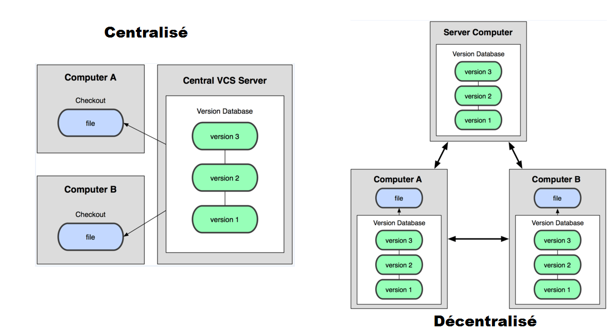
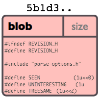
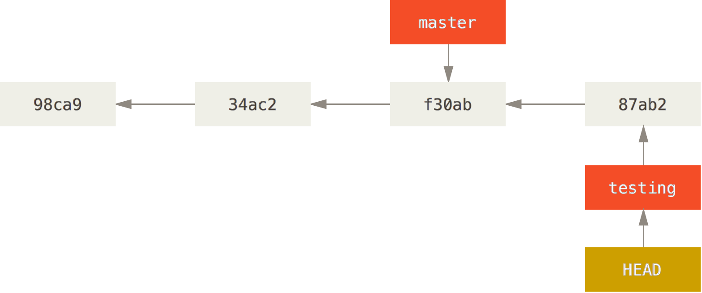
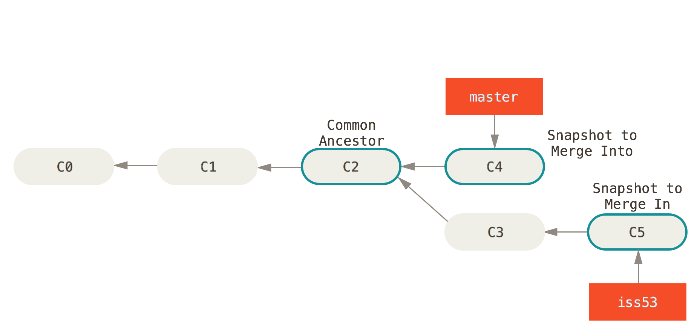
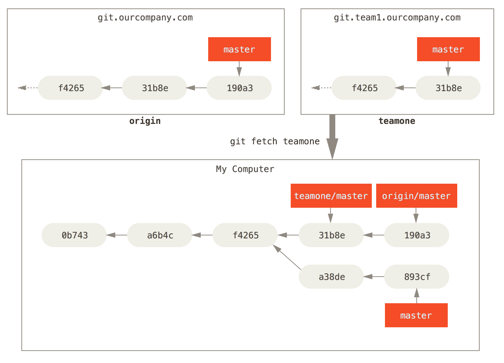

= Git - Apsitech 2016
Kevin MARCELLIER
:backend: deckjs
:deckjs_transition: horizontal-slide

== Git, c'est quoi ?

[quote]
Git is a free and open source distributed version control system designed to handle everything from small to very large projects with speed and efficiency.

=== SCM

* CVS
* Subversion
* Perforce
* ClearCase
* Mercurial

== Histoire

* 1991 → 2002 : Le développement de Linux utilise tarball
* 2002 : Passage à BitKeeper (licences offertes à l'OSS).
* Avril 2005 : Fin annoncée de la licence gratuite
* 7 Avril 2005 : Première version de Git
* 18 Mai 2016 : Version 2.8.3

[quote, Linus Torvalds]
I'm an egotistical bastard, and I name all my projects after myself. First 'Linux', now 'git'.

== Décentralisé

* **D**VCS
* **Dé**centralisé

[%step]
--
* Techniquement, pas besoin de serveur
* _(Presque)_ Tout se passe donc en local
* Après un clone, *tout* l'historique du projet est en local et ne nécessite plus aucun accès réseau pour le manipuler
--

== Les 4 types d'objets

=== Blob

Contenu d'un fichier identifié par un hash

=== Tree

Liste de références vers des hashes

image::resources/object-tree.png[]

== Les 4 types d'objets

=== Commit

Référence le hash d'un tree + métadonnées

image::resources/object-commit.png[]

* Identifié par un hash _SHA-1_
* Version courte ≥ 4 caractères possible (si non ambiguë) : `53b8` = ``53b8``9fc7bb117aee396285f9bc6ce913599a6574

[%step]
--
[quote]
If all 6.5 billion humans on Earth were programming, and every second, each one was producing code that was the equivalent of the entire Linux kernel history (1 million Git objects) and pushing it into one enormous Git repository, it would take 5 years until that repository contained enough objects to have a 50% probability of a single SHA-1 object collision.
--

== Les 4 types d'objets
=== Tag

Nom donné à un commit + métadonnées

image::resources/object-tag.png[]

== Les commits

image::resources/commit.png[]

[%step]
image::resources/commits.png[]

== Orienté contenu
Des Snapshots, pas des diffs...

image::resources/snapshots-vs-delta.png[]

== On commence ?

[%step]
--
[source, console]
$ git config - -global user.name "Kevin Marcellier"
$ git config - -global user.email kevin@marcellier.fr
--

[%step]
--
[source, console]
$ mkdir mon-projet-git
$ cd mon-projet-git/
$ git init
Initialized empty Git repository in mon-projet-git/.git/
$ git commit -m "Initial commit" - -allow-empty
[master (root-commit) 53b89fc] Initial commit
--

[%step]
--
[source, console]
$ touch monFichier.txt
$ git add monFichier.txt
$ git commit -m "Création d'un premier fichier."
[master 2ce6ac4] Création d'un premier fichier.
0 files changed
create mode 100644 monFichier.txt
--

== Les bases : Le staging et les commits

* git add / git rm
* git commit
* git status

image::resources/areas.png[]

[%step]
**Le fichier .gitignore permet de définir les fichier à ignorer.**

== Quelques commandes utiles

=== Log

* git log --pretty=oneline
* git log --pretty=format:"%h - %an, %ar : %s"
* git log --pretty="%h - %s" --author=gitster --since="2008-10-01" --before="2008-11-01" --no-merges
* git log -p -2

=== Diff

* git diff
* git diff --staged

=== Reset

* git reset HEAD monFichier.txt (Unstage)
* git reset --soft HEAD~2
* git reset --hard 4556a12

**Mériterait une présentation complète...**

== Quelques commandes utiles

=== Tag
* git tag
* git tag -l "v1.8.5*"
* git tag -a v1.4 -m "my version 1.4"
* git tag -a v1.2 9fceb02

=== Checkout

* git checkout -- <file> (Discard changes)

=== Reflog

git _reflog_ : un filet de sécurité qui peut vous sauver la vie

[source,role="console"]
$ git reflog
2ce6ac4 HEAD@{0}: checkout: moving from nouvellebranche to master
07df291 HEAD@{1}: checkout: moving from 07df291f4d7fc93b10f28ae25c04fff67d674f30 to nouvellebranche
07df291 HEAD@{2}: commit: Nouveau commit
53b89fc HEAD@{3}: checkout: moving from master to 53b89fc
2ce6ac4 HEAD@{4}: commit: Création du premier fichier indispensable.
53b89fc HEAD@{5}: commit (initial): Initial commit

== Les remotes

[%step]
* git clone
** git clone https://github.com/libgit2/libgit2 myProject
* git remote
** git remote -v
** git remote add github https://github.com/dunska/super-projet
** git remote show origin
* git push
** git push origin [branch]
** git push origin [tagname]
** git push origin --tags

== Créer une branche

[source, console]
$ git branch testing

image::resources/head-to-master.png[]

== Switcher sur une branche
[source, console]
git checkout testing

image::resources/head-to-testing.png[]

== Travailler sur une branche

[source, console]
$ vim test.rb
$ git commit -a -m 'made a change'

== Travailler sur une autre branche (master)

[source, console]
$ git checkout master
$ vim test.rb
$ git commit -a -m 'made other changes'

image::resources/advance-master.png[]

== Merge d'une branche dans une autre

[source, console]
$ git checkout master
Switched to branch 'master'

== Merge d'une branche dans une autre

[source, console]
$ git merge iss53
Merge made by the 'recursive' strategy.
index.html |    1 +
1 file changed, 1 insertion(+)

image::resources/basic-merging-2.png[]

[%step]
_Il peut y avoir des conflits à gérer_

== Le fast-forward

Si possible, Git cherche à ne pas créer de _commit de merge_ même si on lui demande un _merge_

image::resources/basic-branching-4.png[]

== Le fast-forward

[source, console]
$ git checkout master
$ git merge hotfix
Updating f42c576..3a0874c
Fast-forward
 index.html | 2 ++
 1 file changed, 2 insertions(+)

image::resources/basic-branching-5.png[]

[%step]
--
[source, console]
$ git branch -d hotfix
Deleted branch hotfix (3a0874c).
--

== Les branches

Le contenu du repertoire est mis à jour directement lorsque l'on change de branche.

**Pas besoin d'un workspace par branche ! Juste un refresh ;)**

* Vision des branches
** git branch --merged
** git branch --no-merged
* Suppression
** git branch -d testing / git branch -D testing
* Creation
** git checkout -b [branchname] [tagname]

== Le fetch

== Le rebase

image::resources/basic-rebase-1.png[]

== Le rebase

[source, console]
$ git checkout experiment
$ git rebase master
First, rewinding head to replay your work on top of it...
Applying: added staged command

[%step]
image::resources/basic-rebase-3.png[]

== Le rebase

[source, console]
$ git checkout master
$ git merge experiment

[%step]
image::resources/basic-rebase-4.png[]

=== Pull rebase

[source, console]
$ git pull --rebase

== Jouer avec les commits

=== Amend
[source]
$ git commit -m 'initial commit'
$ git add forgotten_file
$ git commit --amend

=== Cherry-pick

Permet d'appliquer un ou des commits données sur la branche actuelle

[source]
$ git cherry-pick d42c389f
$ git cherry-pick master~4 master~2

=== Revert

Permet de créer un commit qui en annule un ou des autres

[source]
$ git revert d42c389f
$ git revert HEAD~3

== Le add partiel

Donne la possibilité de n'ajouter qu'une ou plusieurs parties des changement d'un fichier

[source]
$ git add --patch test.xml
$ git add -p test.xml

[source]
$ git add --interactive
$ git add -i

image::resources/separate.gif[]

== Le rebase interactif

* Editing commit
* Reordering Commits
* Squashing/Fixup Commits
* Splitting a Commit

[source]
$ git rebase -i HEAD~3
pick f7f3f6d changed my name a bit
pick 310154e updated README formatting and added blame
pick a5f4a0d added cat-file
# Rebase 710f0f8..a5f4a0d onto 710f0f8
#
# Commands:
#  p, pick = use commit
#  r, reword = use commit, but edit the commit message
#  e, edit = use commit, but stop for amending
#  s, squash = use commit, but meld into previous commit
#  f, fixup = like "squash", but discard this commit's log message
#  x, exec = run command (the rest of the line) using shell

[%step]
*/!\ Pas de Rebase sur ce qui a été poussé /!\*

== Le bisect

Recherche d'un commit problématique par dichotomie

[source]
$ git bisect start
$ git bisect bad                 # Current version is bad
$ git bisect good v2.6.13-rc2    # v2.6.13-rc2 is known to be good

== Les alias

[source]
$ git config --global alias.co checkout
$ git config --global alias.br branch
$ git config --global alias.ci commit
$ git config --global alias.st status
$ git config --global alias.unstage 'reset HEAD --'

== Les IHM

* Ligne de commande (gitk, git gui)
* SourceTree
* SmartGit
* Plugin Eclipse
* Intégration native Atom, SublimeText

image::resources/IHM.png[]

== Intégration

=== L'hébergement

* GitHub
* BitBucket
* Gitlab
* Gogs

=== Les outils

* Gitflow
* Gerrit
* Git-SVN

== Avantages et inconvénients

=== Avantages

* Rapide
* Puissant
* De beaux historiques
* Système de branches

=== Inconvénients

* Premiers pas compliqués
* Noms ou utilisation de commandes parfois déroutantes, notamment quand on vient de Svn
** git checkout = svn switch, ou revert pour un seul fichier…​
** git reset --hard = svn revert -R *
** add : résoudre un conflit, ajouter tout ou partie d’un fichier…​
* **Retour à SVN difficile**

== Mais encore...

* Revision Selection
* Interactive Staging
* Stash & Clean
* Grep
* ...

[%step]
image::resources/end.gif[]
